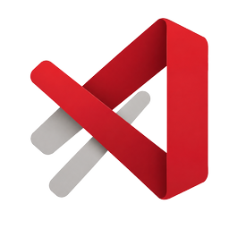

<div align="center">
  
  <h1>Paprv</h1>
  <p>A macOS paper Study workspace with an independent Markdown Vault.</p>
</div>

Paprv separates imported research material from your own writing. A paper opens in Study with its arXiv metadata, abstract, generated study aids, and explicitly saved AI artifacts. The Vault is a separate Obsidian-inspired workspace where you can create and edit any number of Markdown documents.

Documents do not belong to a paper. Explicit links can connect one document to many papers or saved artifacts, and backlinks are derived from those stored relationships.

## Current workspace

- Fetch metadata from an arXiv abstract or PDF link.
- Browse saved paper records by title, author, or arXiv ID.
- Write multiple independent Markdown documents in the Vault's editor-first native-textarea surface. A subtle `Vault / name.md` breadcrumb contains the document-name input; there is no document Preview mode, formatting toolbar, or always-visible save/revision/word-count chrome.
- Open paper metadata, abstract, generation previews, and explicitly saved AI artifacts in Study.
- Link documents explicitly to papers or saved artifacts and inspect stored backlinks.
- Store paper metadata, Study artifacts, Markdown documents, and links in a local SQLite database.
- Ask naturally for a translation, simple explanation, technical deep dive, or technical polish in a dense Claude-like Study composer. Paprv chooses exactly one closed skill and English or Korean for the request; technical polish is available only for a saved document or exact captured selection.
- Check technical-polish output so protected code, math, citation, URL, and DOI spans survive unchanged.
- Keep generated output in Study unless the user explicitly saves it as an artifact; generation never modifies a Markdown document.
- Choose an agent and context from compact composer controls. Claude Code is currently the only generation-capable agent; Codex CLI remains disabled and discovery-only.
- Use the same compact workspace in dark or light mode.

Paprv currently fetches metadata only; it does not upload, download, display, or parse PDF files. Local generation can use only the stored abstract or selected Vault document text, so it is not whole-paper analysis or paper evidence. Technical polishing checks protected spans deterministically, but it does not verify claims or prove that a citation supports surrounding prose.

The Study dialog is request-first rather than a form for Task, Source, and Output language. Its trimmed request must be non-empty, no more than 4096 UTF-8 bytes, and free of unsafe control characters. One Claude invocation interprets that intent, selects exactly one of `translate_structure`, `explain_simply`, or `technical_deep_dive` plus English or Korean, and returns Markdown. Document-backed requests may also select `technical_polish`; abstract requests cannot. This is closed study-skill selection, not arbitrary shell or tool dispatch.

Paprv does not collect or store provider credentials. Claude Code must already be installed and signed in by the user. Paprv invokes it directly with an empty `--tools` value and `--disallowedTools '*'`; readiness checks run under the same app-owned lifecycle as generation. The installed CLI may still be subject to organization-managed hooks, so the no-tools invocation is not proof that managed policy performs no work. Codex remains visible for executable discovery, but Paprv never launches it because the official Codex CLI reference does not document an all-tools-off contract. Provider capability references were retrieved on 2026-08-19: [Claude Code CLI reference](https://code.claude.com/docs/en/cli-reference), [Claude Code hooks reference](https://code.claude.com/docs/en/hooks), and [Codex CLI reference](https://developers.openai.com/codex/cli/reference).

The natural-language request exists only while its Study dialog is open. Rust receives it on provider stdin beside separately resolved source text; Paprv never saves or logs it and never returns it in a run DTO, artifact, result metadata, or summary. Progress, errors, result Markdown, and safe metadata appear as conversational assistant content. Saving creates a Study artifact; linking that artifact to a Vault document is a separate action. Existing SQLite v5 artifact fields store the selected skill and language—there is no v6 migration. A saved source snapshot preserves only the source document's identity. The artifact's separate provenance records the revision number and selection offsets where applicable, but Paprv does not retain the source revision text.

## arXiv interoperability

<p>
  <a href="https://arxiv.org/">
    
  </a>
</p>

Paprv retrieves public metadata through the official arXiv API. The Rust backend accepts canonical arXiv references and does not fetch caller-selected endpoints.

Thank you to arXiv for use of its open access interoperability. This product was not reviewed or approved by, nor does it necessarily express or reflect the policies or opinions of, arXiv.

The arXiv name and logo are registered trademarks and the legal property of arXiv. The logo is shown only to acknowledge Paprv's use of arXiv data and interoperability. See the [arXiv name and logo use guidelines](https://info.arxiv.org/brand/brand-guidelines.html).

## Development

### Prerequisites

- macOS 11 or later
- Xcode Command Line Tools
- Node.js 24 or later
- pnpm 11.21 (`corepack enable` can provide the pinned package manager)
- Rust 1.85 or later with the stable toolchain

Claude Code is optional. Local study-aid generation is available only when a compatible `claude` executable is already installed and `claude auth status` exits successfully; Paprv ignores the probe body and never collects login credentials. Codex may appear in the picker, but it is discovery-only and cannot be selected.

### Run locally

```sh
git clone https://github.com/rlaope/paperv.git
cd paperv
corepack enable
pnpm install --frozen-lockfile
pnpm dev
```

Build a local macOS application bundle:

```sh
pnpm tauri build --debug
```

The bundle is written under `src-tauri/target/debug/bundle/macos/Paprv.app`.

### Verification

```sh
pnpm lint
pnpm typecheck
pnpm test
pnpm test:a11y
pnpm test:eval
pnpm build
cargo fmt --manifest-path src-tauri/Cargo.toml -- --check
cargo clippy --manifest-path src-tauri/Cargo.toml --all-targets --all-features -- -D warnings
cargo test --manifest-path src-tauri/Cargo.toml --all-features
```

Native integration changes should also run the packaged runtime gates documented in [`AGENTS.md`](AGENTS.md). The live arXiv and authenticated Claude interoperability probes are explicit opt-in checks rather than default tests.

## Contributing

Issues and pull requests are welcome. Preserve the Study/Vault separation, add a failing regression test before fixing a defect, keep privileged work in Rust, and run the applicable verification gates before submitting a change. Do not commit local `.omc/`, `.hermes/`, provider configuration, credentials, or generated build directories.

## Project status

Paprv is an early macOS desktop build using Tauri 2, Rust, React, TypeScript, Vite, and SQLite. PDF reading and source-passage links are planned work, not current functionality.

## License

Paprv is licensed under the [Apache License 2.0](LICENSE).
